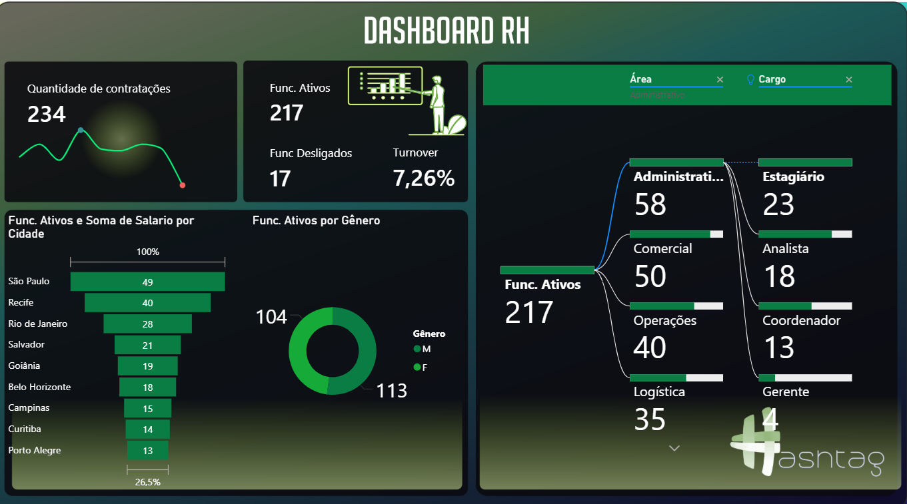

# Dashboard_Rh_powerbi
Esse dashboard foi desenvolvido para o rh.

Respondemos perguntas como: 

📊 Qual é a quantidade de contratções?
📊 Quais são os funcionários antigos? 
📊 Quais foram os profissionais desligados? 
📊 Qual é a taxa de turnover?
📊 Qual é a soma de salário dos funcionários ativos por cidade?
📊 Quais são os funcionários ativos por genêro?

Durante o desenvolvimento, passamos por algumas etapas importantes:

🔹 Importação dos dados a partir do Excel 
 
🔹 Tratamento e limpeza dos dados no Power Query 

🔹 Criação do layout no figma e importação para o Power BI como template.

